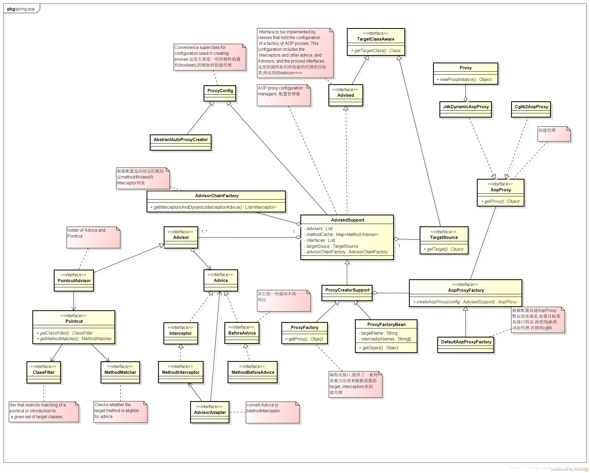

# 好文收藏

## [分布式锁的介绍和实现方式介绍](https://www.jianshu.com/p/34e1c0f4475a)
> 基于数据库  
> 基于redis  
> 基于zookeeper  

## [什么是事务分布式?](https://blog.csdn.net/forezp/article/details/84503386)
> 使用事务分布式解决服务直接调用时，超时等误操影响的数据不一致问题。

## [深入理解分布式事务,高并发下分布式事务的解决方案](https://blog.csdn.net/u010425776/article/details/79516298)

## [形象的理解面向切面编程](https://www.cnblogs.com/xuejupo/p/5206087.html)

## [aop深入理解](https://blog.csdn.net/yuexianchang/article/details/77018603)

* [ProxyFactroyBean](https://blog.csdn.net/linuu/article/details/50972036)